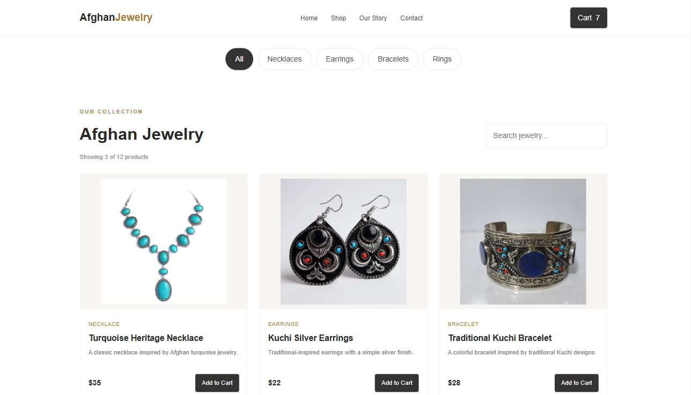
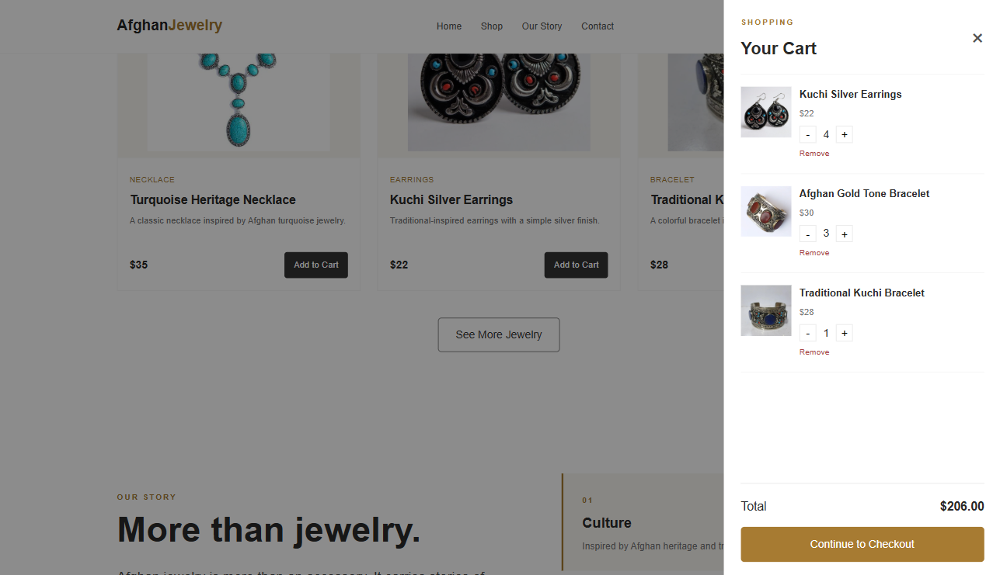
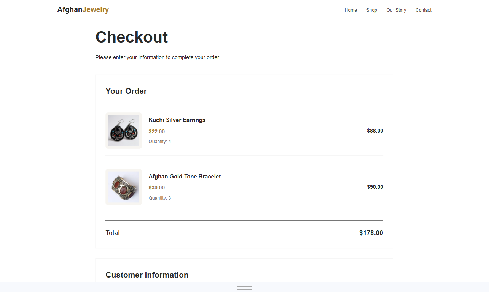

# AfghanJewelry

A responsive e-commerce website for Afghan jewelry, built with HTML, CSS, and JavaScript.

## Live Demo

[View AfghanJewelry](https://afghan-jewelry.netlify.app/)

## Project Preview

### Home Page


### Shop



### Shopping Cart



### Checkout



---

## About the Project

AfghanJewelry is a front-end e-commerce website created to practice and demonstrate web development skills.

The website allows users to explore Afghan-inspired jewelry, search for products, filter products by category, add items to a shopping cart, manage quantities, and continue to the checkout page.

The main focus of the project was creating a clean, simple, and responsive shopping experience.

## Features

* Responsive design for desktop, tablet, and mobile
* Product search
* Category filtering
* Product cards
* Add to cart
* Increase and decrease product quantity
* Remove products from cart
* Automatic cart total calculation
* Local Storage for cart data
* Checkout page
* Contact form
* Newsletter subscription form
* Responsive navigation

## Technologies

* HTML5
* CSS3
* JavaScript
* Local Storage

## Project Structure

```text
AfghanJewelry/
│
├── index.html
├── style.css
├── script.js
├── checkout.html
├── checkout.js
│
└── images/
    ├── hero.png
    ├── Afghan Silver.jpeg
    ├── Afghan Kuchi Silber Schmuc.jpeg
    ├── Afghan Turquoise Ring.jpeg
    ├── Afghani Baloch Turkman.jpeg
    ├── Blue Sapphire Ring.jpeg
    ├── Blue Stone Bracelet.jpeg
    ├── Bracelet.jpeg
    ├── Drop Earrings.jpeg
    ├── Earrings.jpeg
    ├── gold-bracelet.jpeg
    ├── Handmade Afghan.jpeg
    └── silver Ring.jpeg
```

## How It Works

### Product Search

Users can search for jewelry by entering a product name in the search field.

### Category Filter

Products can be filtered by category:

* Necklaces
* Earrings
* Bracelets
* Rings

### Shopping Cart

Users can add products to their cart, increase or decrease quantities, remove products, and view the total price.

Cart information is saved using browser Local Storage, so the cart remains available after refreshing the page.

### Checkout

The checkout page displays the selected products, quantities, prices, and total amount.

## Responsive Design

The website is designed to work across different screen sizes.

On smaller screens, the navigation adjusts to keep the menu visible and easy to use. Product cards, forms, the shopping cart, and checkout sections also adapt to mobile layouts.

## What I Practiced

While building this project, I practiced:

* Creating responsive layouts with CSS
* Working with JavaScript arrays and objects
* Filtering and searching data
* DOM manipulation
* Handling user interactions
* Using Local Storage
* Building a shopping cart
* Managing product quantities
* Connecting multiple HTML pages
* Organizing a front-end project

## Future Improvements

Possible future improvements include:

* Product details pages
* User accounts
* Backend and database integration
* Real payment integration
* Order history
* Admin dashboard
* Product management
* Order management

## Author

**Hananeh Mojadadi**

Computer Science Student | Front-End Developer

GitHub: [@hananehmojadadi](https://github.com/hananehmojadadi)
